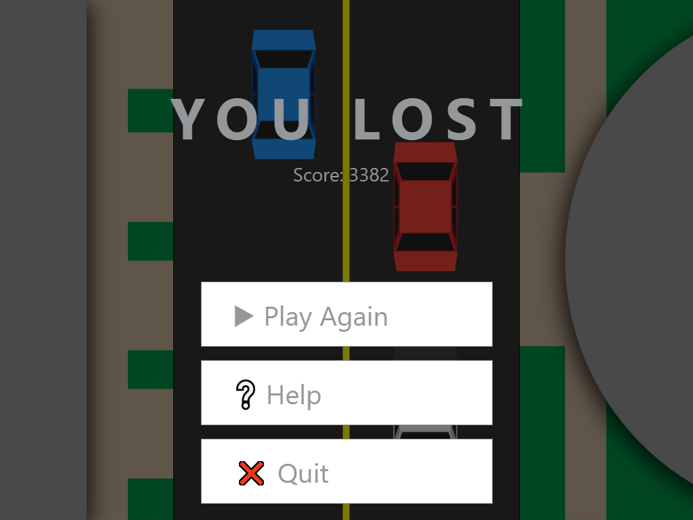

# Turbulent Tailing
### ICS2O1 Final Project
#### Victor and Nicholas

## Proposal
We are making a car chase game where you avoid other cars, buildings, hydrants and occasional construction sites. The user will be able to accelerate and decelerate the car and have it change lanes. The car will stay in the same space at the bottom of the screen, but the background will move to make it look like the car is moving. There will be a main menu where the user can interact with the mouse or keyboard and it will have an option to learn to interact with the game. The user will interact in the game with the arrow keys. We will be using sprites in Pygame for graphics and the cars and obstacles will be randomly generated.

## Design
### Program Overview
Turbulent Tailing is a car chase game where the user must avoid obstacles such as oncoming traffic, traffic from intersecting roads and buildings along the side of the road. The user will be able to increase and decrease acceleration and steer with the arrow keys. The car will slowly decelerate and be captured if the user does not accelerate over time. The user could also become captured if they hit another car, veer off the road and crash, or run a red light. The game is kept interesting by randomly generated obstacles.

### Screen Layouts and Basic Input
For an interactive version, visit our mockup of the basic application flow on [Adobe XD](https://xd.adobe.com/view/002886b5-0f98-4fb5-9d2f-e04b70b18efe/).
#### Main Menu

#### Help Screen

#### In Game

#### Pause Menu

#### End Screen

### Description of Key Variables
#### Variables that keep track of the current game's state
| Variable   | Type  | Description                                                                                  |
| :--------: | :---: | -------------------------------------------------------------------------------------------- |
| timePassed | int   | The number of frames that have been rendered in the current game. Used to calculate `score`. |
| score      | int   | Number of points the user has in the current game.                                           |
| highScore  | int   | The player's high score across all games played.                                             |
| speed      | int   | The number of pixels the background moves every frame. (the car's speed)                     |
| cars       | array | Keeps track of the co-ordinates of all the oncoming cars on the screen.                      |

#### Each individual car object
| Variable  | Type  | Description                                     |
| :-------: | :---: | ----------------------------------------------- |
| x         | int   | The x coordinate of the car                     |
| y         | int   | The y coordinate of the car                     |
| speed     | int   | The speed of the car relative to the background |
| direction | float | The direction of the car in radians             |
### Program Plan
#### Show the main menu over a never-ending simulation of the game
 - Create the background and the cars
 - Display the text and buttons over the simulation
 - Read the high score from a file
 - Move cars slowly in the background
 - Occasionally move the car being chased, then don't display any oncoming cars in front of it
 - Go to screen depending on which button is pressed

#### Display the help page
 - Display text, images and buttons
 - Go to screen depending on which button is pressed

#### Playing the game
 - Create the backgrounds and the cars
 - Throughout the game, track how long the player has been alive using `timePassed`
 - Calculate the player's `score` and display it in the top right of the screen
 - Check if the player pushes any buttons to control their car
 - Accelerate/turn the car depending on which button is pressed
 - If the user hits the pause button, display the pause screen
 - If the player comes in contact with another car/building, stop the car
 - If the player runs over an obstacle (i.e. traffic cone, fire hydrant) reduce the player's `speed` temporarily
 - If the police car comes into contact with the player, show the game over screen

#### Pausing the game
 - Make the game tinted with all cars stopped
 - Display the text and buttons
 - Resume the game/Go to a screen depending on which button is pressed

#### End screen/Game over
 - Prevent the user from controlling their car
 - Display the text and buttons
 - If the `score` is greater than `highScore`, make `highScore` equal `score` and save it to the file
 - Go to screen depending on which button is pressed
